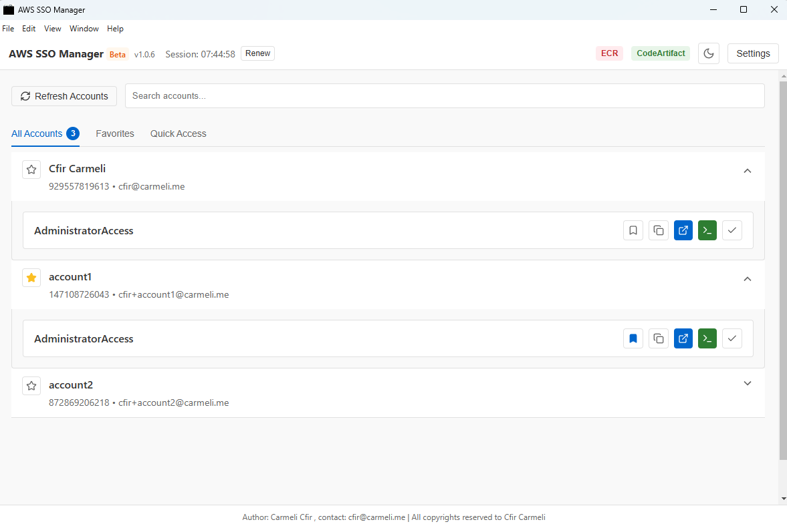
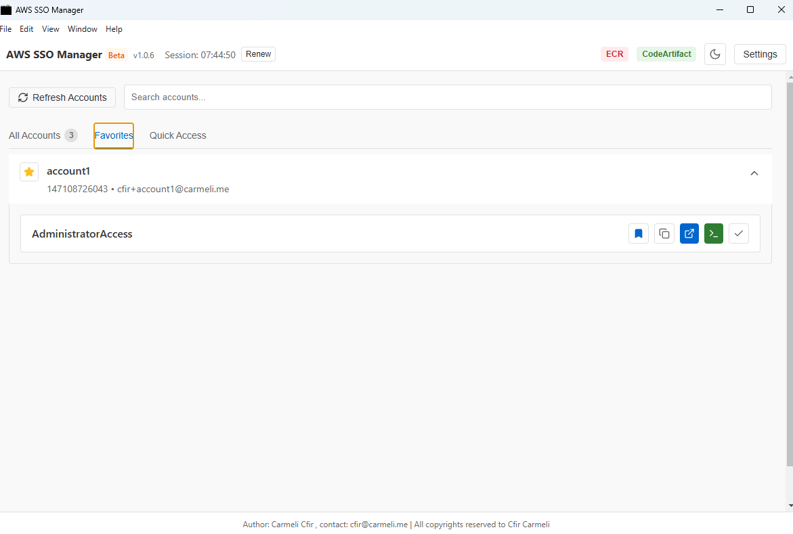
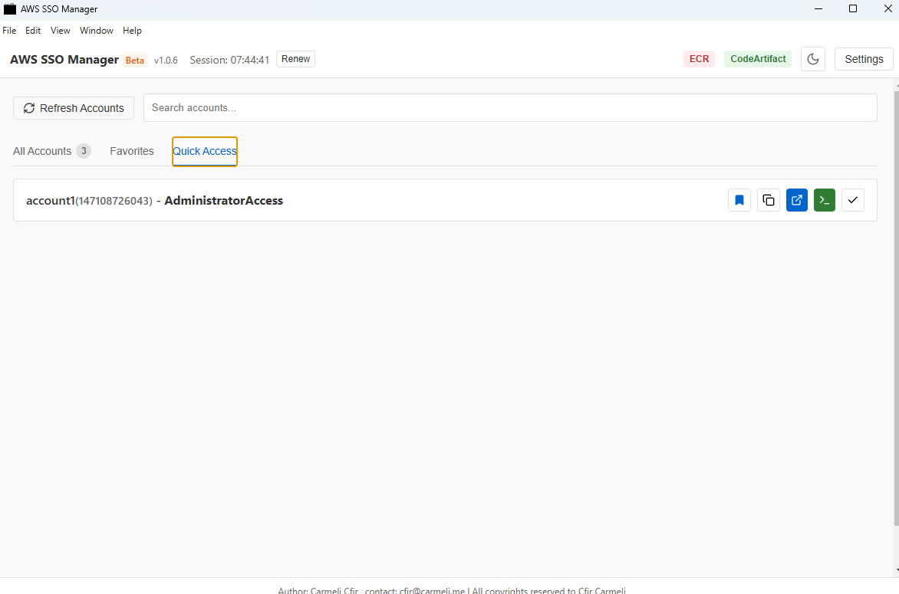

# AWS SSO Manager

A modern desktop application built with Electron and React for managing AWS SSO sessions and role switching across multiple AWS accounts.

## Features

- 🔐 Easy AWS SSO login and session management
- 👥 Switch between multiple AWS accounts and roles
- 🔄 Automatic session refresh
- 📊 ECR and CodeArtifact integration
- ⚡ Fast role switching with favorites
- 🎨 Modern and intuitive user interface
- 🌙 Dark mode support
- 🔍 Powerful search capabilities for quick account and role access
- 🔄 Manual refresh button for account list updates
- 🌐 Direct AWS Console access for any role with one click
- 📊 Visual account counter to track available AWS accounts
- ⏳ Loading indicators for better user experience

## Screenshots

### All Accounts View


### Favorites


### Quick Access


## Installation

### macOS

#### Using the installer:
1. Download the latest release from the [Releases](https://github.com/cfircoo/aws-sso-manager/releases) page
2. Open the downloaded `.dmg` file
3. Drag the AWS SSO Manager app to your Applications folder
4. Open the app from your Applications folder

#### Using the install script:
1. Clone the repository:
   ```bash
   git clone https://github.com/cfircoo/aws-sso-manager.git
   cd aws-sso-manager
   ```
2. Run the installation script:
   ```bash
   ./mac_install.sh
   ```
   This will build the application, create a DMG file, and install it to your Applications folder.

### Windows

#### Using the installer:
1. Download the latest release from the [Releases](https://github.com/cfircoo/aws-sso-manager/releases) page
2. Run the downloaded `.exe` file
3. Follow the installation prompts
4. Open the app from your Start menu

#### Using the install script:
1. Clone the repository:
   ```bash
   git clone https://github.com/cfircoo/aws-sso-manager.git
   cd aws-sso-manager
   ```
2. Run the installation script:
   ```cmd
   .\win_install.bat
   ```
   This will build the application and install it to your Programs folder.

### Prerequisites

- macOS 10.15 or later or Windows 10/11
- Active AWS SSO configuration
- AWS CLI v2 installed (optional, for some features)
- Node.js and npm (for building from source)

## Development

### Setup

1. Clone the repository:
```bash
git clone https://github.com/cfircoo/aws-sso-manager.git
cd aws-sso-manager
```

2. Install dependencies:
```bash
npm install
```

3. Start the development server:
```bash
npm run dev
```

### Building

#### macOS

Build the application:
```bash
npm run build-mac
```

Create a DMG installer:
```bash
npm run make-dmg
```

This will create a `.dmg` installer in the `release` directory.

#### Windows

Build the application:
```bash
npm run build-win
```

This will create an installer in the `release` directory.

## Configuration

The application stores its configuration in:

### macOS
```
~/Library/aws-sso-manager/settings.json
```

### Windows
```
%APPDATA%\aws-sso-manager\settings.json
```

AWS credentials and configurations are stored in the standard AWS CLI locations:

### macOS
```
~/.aws/config
~/.aws/credentials
```

### Windows
```
%USERPROFILE%\.aws\config
%USERPROFILE%\.aws\credentials
```

## Security

- All sensitive information is stored securely using the system's keychain/credential manager
- No AWS credentials are stored in plain text
- Session tokens are managed securely and automatically refreshed

## License

This project is open source under the MIT License with Commons Clause - see the [LICENSE](LICENSE) file for details. This means you can freely use, modify, and distribute the code, but you cannot sell the software or use it for commercial purposes without explicit permission. The Commons Clause restriction applies specifically to commercial use and selling of the software.

## Version History

- v1.0.5 - Latest release
  - Added account refresh functionality
  - Added direct AWS Console access via role
  - Improved search interface with better layout
  - Added account counter badge on tabs
  - Enhanced loading indicators for better UX
  - Various UI improvements and bug fixes
- v1.0.4 - Previous stable release
  - Improved UI/UX
  - Added ECR and CodeArtifact support
  - Bug fixes and performance improvements
  - Added Windows installer support

## Support

For support, please open an issue in the GitHub repository or contact the maintainers at cfir@carmeli.me.

## Acknowledgments

- Built with [Electron](https://www.electronjs.org/)
- UI powered by [React](https://reactjs.org/)
- Styling with [Tailwind CSS](https://tailwindcss.com/)
